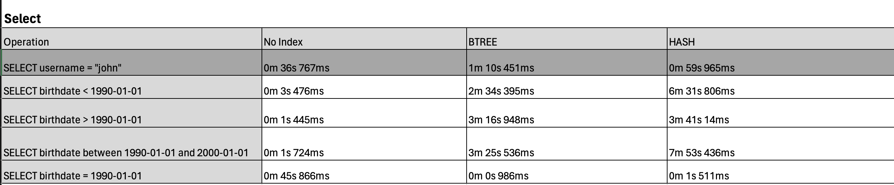
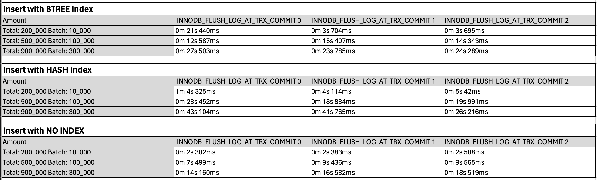

# This summary should provide a clear picture of your MySQL index performance tests. 

Dataset ~70M rows

### Select operations perfomance
username column doesn't have index, but speed of filtration varies with different indexes options

### Insert operations perfomance
Analyze the impact of different INNODB_FLUSH_LOG_AT_TRX_COMMIT setting value 

### CREATE/DROP operations of indexes perfomance

## Summary 
This analysis highlights the importance of tuning MySQL settings and indexing strategies to optimize performance, particularly when dealing with large data sets. Each scenario has trade-offs between read and write performance, which must be balanced according to the application's requirements.