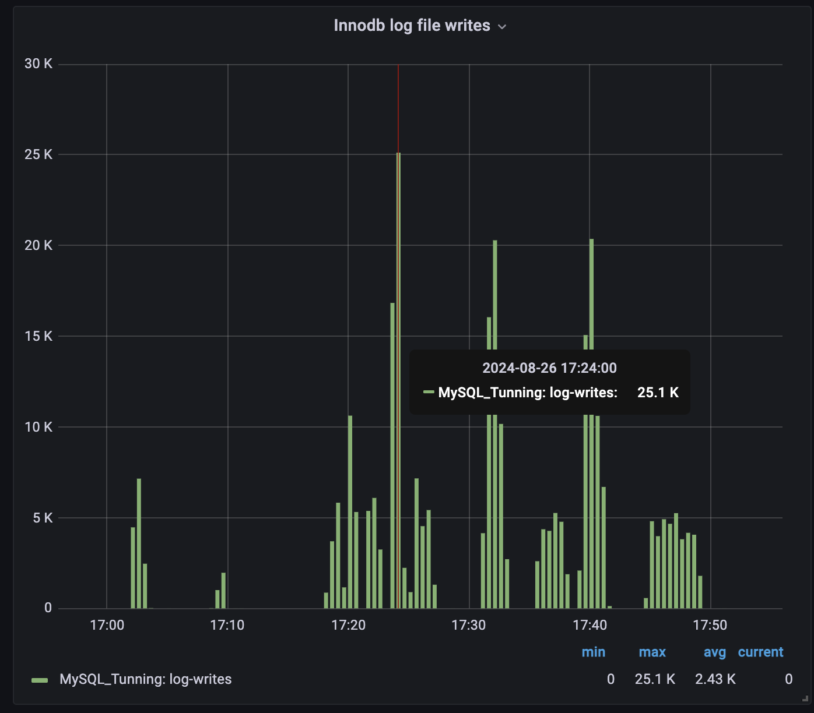

# This summary should provide a clear picture of your MySQL index performance tests. 

Dataset ~10M rows

## Summary of tests with siege perfomance testing 

## NO index 
### SELECT
1. Request: ```siege -c50 -r10 -b http://0.0.0.0:3000/users/list```
    - Result: 
        - Transactions:                    500 hits
        - Availability:                 100.00 %
        - Elapsed time:                 223.00 secs
        - Data transferred:               0.06 MB
        - Response time:                 22.13 secs
        - Transaction rate:               2.24 trans/sec
        - Throughput:                     0.00 MB/sec
        - Concurrency:                   49.62
        - Successful transactions:         500
        - Failed transactions:               0
        - Longest transaction:           30.79
        - Shortest transaction:          12.85

### INSERT 
TOTAL_USERS_TO_INSERT=1000
BATCH_SIZE=100
1. Request: ```siege -c50 -r1 -b 'http://0.0.0.0:3000/users/insert POST' -H "Content-Type: text/plain"```
    - 1.1 INNODB_FLUSH_LOG_AT_TRX_COMMIT=0   
        - Result: 
            - Transactions:                     50 hits
            - Availability:                 100.00 %
            - Elapsed time:                   0.65 secs
            - Data transferred:               0.01 MB
            - Response time:                  0.46 secs
            - Transaction rate:              76.92 trans/sec
            - Throughput:                     0.01 MB/sec
            - Concurrency:                   35.05
            - Successful transactions:          50
            - Failed transactions:               0
            - Longest transaction:            0.65
            - Shortest transaction:           0.28
    - 1.2 INNODB_FLUSH_LOG_AT_TRX_COMMIT=1
        - Result:
            - Transactions:                     50 hits
            - Availability:                 100.00 %
            - Elapsed time:                   0.89 secs
            - Data transferred:               0.01 MB
            - Response time:                  0.69 secs
            - Transaction rate:              56.18 trans/sec
            - Throughput:                     0.01 MB/sec
            - Concurrency:                   38.96
            - Successful transactions:          50
            - Failed transactions:               0
            - Longest transaction:            0.89
            - Shortest transaction:           0.45
    - 1.3 INNODB_FLUSH_LOG_AT_TRX_COMMIT=2
    -     Result: 
            - Transactions:                     50 hits
            - Availability:                 100.00 %
            - Elapsed time:                   0.91 secs
            - Data transferred:               0.01 MB
            - Response time:                  0.67 secs
            - Transaction rate:              54.95 trans/sec
            - Throughput:                     0.01 MB/sec
            - Concurrency:                   37.05
            - Successful transactions:          50
            - Failed transactions:               0
            - Longest transaction:            0.91
            - Shortest transaction:           0.45
2. Request: ```siege -c100 -r1 -b 'http://0.0.0.0:3000/users/insert POST' -H "Content-Type: text/plain"```
    - 2.1 INNODB_FLUSH_LOG_AT_TRX_COMMIT=0   
        - Result:
            - Transactions:                    100 hits
            - Availability:                 100.00 %
            - Elapsed time:                   1.60 secs
            - Data transferred:               0.01 MB
            - Response time:                  1.05 secs
            - Transaction rate:              62.50 trans/sec
            - Throughput:                     0.01 MB/sec
            - Concurrency:                   65.35
            - Successful transactions:         100
            - Failed transactions:               0
            - Longest transaction:            1.59
            - Shortest transaction:           0.51

    - 2.2 INNODB_FLUSH_LOG_AT_TRX_COMMIT=1
        - Result: 
            - Transactions:                    100 hits
            - Availability:                 100.00 %
            - Elapsed time:                   1.41 secs
            - Data transferred:               0.01 MB
            - Response time:                  0.87 secs
            - Transaction rate:              70.92 trans/sec
            - Throughput:                     0.01 MB/sec
            - Concurrency:                   61.55
            - Successful transactions:         100
            - Failed transactions:               0
            - Longest transaction:            1.41
            - Shortest transaction:           0.31

    - 2.3 INNODB_FLUSH_LOG_AT_TRX_COMMIT=2
        - Result: 
            - Transactions:                    100 hits
            - Availability:                 100.00 %
            - Elapsed time:                   1.33 secs
            - Data transferred:               0.01 MB
            - Response time:                  0.84 secs
            - Transaction rate:              75.19 trans/sec
            - Throughput:                     0.01 MB/sec
            - Concurrency:                   62.96
            - Successful transactions:         100
            - Failed transactions:               0
            - Longest transaction:            1.33
            - Shortest transaction:           0.31

## BTREE index
### SELECT
1.  Request: ```siege -c100 -r10 -b http://0.0.0.0:3000/users/list```
    - Result: 
        - Transactions:                   1000 hits
        - Availability:                 100.00 %
        - Elapsed time:                  11.58 secs
        - Data transferred:               0.13 MB
        - Response time:                  1.10 secs
        - Transaction rate:              86.36 trans/sec
        - Throughput:                     0.01 MB/sec
        - Concurrency:                   94.78
        - Successful transactions:        1000
        - Failed transactions:               0
        - Longest transaction:            2.61
        - Shortest transaction:           0.05
2.  Request: ```siege -c50 -r10 -b http://0.0.0.0:3000/users/list```
    - Result: 
        - Transactions:                    500 hits
        - Availability:                 100.00 %
        - Elapsed time:                   6.65 secs
        - Data transferred:               0.06 MB
        - Response time:                  0.64 secs
        - Transaction rate:              75.19 trans/sec
        - Throughput:                     0.01 MB/sec
        - Concurrency:                   48.43
        - Successful transactions:         500
        - Failed transactions:               0
        - Longest transaction:            1.46
        - Shortest transaction:           0.08

### INSERT
    TOTAL_USERS_TO_INSERT=1000
    BATCH_SIZE=100
1.  - Request: ```siege -c50 -r1 -b 'http://0.0.0.0:3000/users/insert POST' -H "Content-Type: text/plain"```
    - 1.1 INNODB_FLUSH_LOG_AT_TRX_COMMIT=0
        - Result: 
            - Transactions:                     50 hits
            - Availability:                 100.00 %
            - Elapsed time:                   6.40 secs
            - Data transferred:               0.01 MB
            - Response time:                  6.28 secs
            - Transaction rate:               7.81 trans/sec
            - Throughput:                     0.00 MB/sec
            - Concurrency:                   49.07
            - Successful transactions:          50
            - Failed transactions:               0
            - Longest transaction:            6.40
            - Shortest transaction:           5.59

    - 1.2 INNODB_FLUSH_LOG_AT_TRX_COMMIT=1
        - Result: 
            - Transactions:                     50 hits
            - Availability:                 100.00 %
            - Elapsed time:                   0.91 secs
            - Data transferred:               0.01 MB
            - Response time:                  0.76 secs
            - Transaction rate:              54.95 trans/sec
            - Throughput:                     0.01 MB/sec
            - Concurrency:                   41.96
            - Successful transactions:          50
            - Failed transactions:               0
            - Longest transaction:            0.91
            - Shortest transaction:           0.57

    - 1.3 INNODB_FLUSH_LOG_AT_TRX_COMMIT=2
        - Result: 
            - Transactions:                     50 hits
            - Availability:                 100.00 %
            - Elapsed time:                   0.88 secs
            - Data transferred:               0.01 MB
            - Response time:                  0.76 secs
            - Transaction rate:              56.82 trans/sec
            - Throughput:                     0.01 MB/sec
            - Concurrency:                   42.93
            - Successful transactions:          50
            - Failed transactions:               0
            - Longest transaction:            0.88
            - Shortest transaction:           0.56

2.  Request: ```siege -c100 -r1 -b 'http://0.0.0.0:3000/users/insert POST' -H "Content-Type: text/plain"```
    - 2.1 INNODB_FLUSH_LOG_AT_TRX_COMMIT=0
        - 2.1.1 
            TOTAL_USERS_TO_INSERT=1000
            BATCH_SIZE=100
            - Result: 
                - Transactions:                    100 hits
                - Availability:                 100.00 %
                - Elapsed time:                   1.82 secs
                - Data transferred:               0.01 MB
                - Response time:                  1.37 secs
                - Transaction rate:              54.95 trans/sec
                - Throughput:                     0.01 MB/sec
                - Concurrency:                   75.03
                - Successful transactions:         100
                - Failed transactions:               0
                - Longest transaction:            1.82
                - Shortest transaction:           0.64
        - 2.1.2 
            TOTAL_USERS_TO_INSERT=10000
            BATCH_SIZE=2000
            - Result: 
                - Transactions:                    100 hits
                - Availability:                 100.00 %
                - Elapsed time:                  44.47 secs
                - Data transferred:               0.01 MB
                - Response time:                 42.17 secs
                - Transaction rate:               2.25 trans/sec
                - Throughput:                     0.00 MB/sec
                - Concurrency:                   94.84
                - Successful transactions:         100
                - Failed transactions:               0
                - Longest transaction:           44.46
                - Shortest transaction:          31.83
        
    - 2.2 INNODB_FLUSH_LOG_AT_TRX_COMMIT=1
        - 2.2.1 
            TOTAL_USERS_TO_INSERT=1000
            BATCH_SIZE=100
            - Result: 
                - Transactions:                    100 hits
                - Availability:                 100.00 %
                - Elapsed time:                   2.22 secs
                - Data transferred:               0.01 MB
                - Response time:                  1.59 secs
                - Transaction rate:              45.05 trans/sec
                - Throughput:                     0.01 MB/sec
                - Concurrency:                   71.78
                - Successful transactions:         100
                - Failed transactions:               0
                - Longest transaction:            2.21
                - Shortest transaction:           0.48
        - 2.2.2 
            TOTAL_USERS_TO_INSERT=10000
            BATCH_SIZE=2000
            - Result: 
                - Transactions:                    100 hits
                - Availability:                 100.00 %
                - Elapsed time:                 105.94 secs
                - Data transferred:               0.01 MB
                - Response time:                104.08 secs
                - Transaction rate:               0.94 trans/sec
                - Throughput:                     0.00 MB/sec
                - Concurrency:                   98.25
                - Successful transactions:         100
                - Failed transactions:               0
                - Longest transaction:          105.94
                - Shortest transaction:          93.88
    - 2.3 INNODB_FLUSH_LOG_AT_TRX_COMMIT=2
        - 2.3.1 
            TOTAL_USERS_TO_INSERT=1000
            BATCH_SIZE=100
            - Result: 
                - Transactions:                    100 hits
                - Availability:                 100.00 %
                - Elapsed time:                   1.93 secs
                - Data transferred:               0.01 MB
                - Response time:                  1.41 secs
                - Transaction rate:              51.81 trans/sec
                - Throughput:                     0.01 MB/sec
                - Concurrency:                   72.86
                - Successful transactions:         100
                - Failed transactions:               0
                - Longest transaction:            1.93
                - Shortest transaction:           0.47
        - 2.3.2 
            TOTAL_USERS_TO_INSERT=10000
            BATCH_SIZE=2000
            - Result: 
                - Transactions:                    100 hits
                - Availability:                 100.00 %
                - Elapsed time:                 120.73 secs
                - Data transferred:               0.01 MB
                - Response time:                108.32 secs
                - Transaction rate:               0.83 trans/sec
                - Throughput:                     0.00 MB/sec
                - Concurrency:                   89.72
                - Successful transactions:         100
                - Failed transactions:               0
                - Longest transaction:          120.73
                - Shortest transaction:          81.84

## Perfomance usage metrics 
Below You will find the list of perfomance specs of MySQL and System, which shows how perfomance was changing during the highload tests; 

VM Docker container specs:
    CPU Limit: 8
    Memory Limit: 4
    Virtual Disk limit: 61

### System Perfomance

CPU


Load 


Disk inodes


Disk usage


Memory usage


### MySQL Perfomance

Trafic


Threads


Tables


Queries


Locks


Files


InnoDB_buffer_pool_pages


InnoDB_buffer_pool_requests


InnoDB_data_operations


InnoDB_log_files_writes


Handlers


Handlers


## Summary 
This analysis highlights the importance of tuning MySQL settings and indexing strategies to optimize performance, particularly when dealing with large data sets. Each scenario has trade-offs between read and write performance, which must be balanced according to the application's requirements.